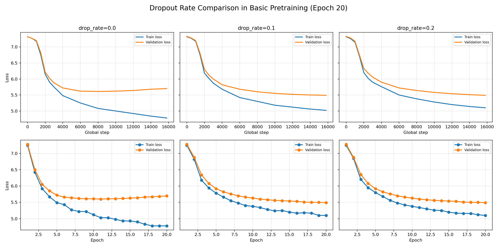
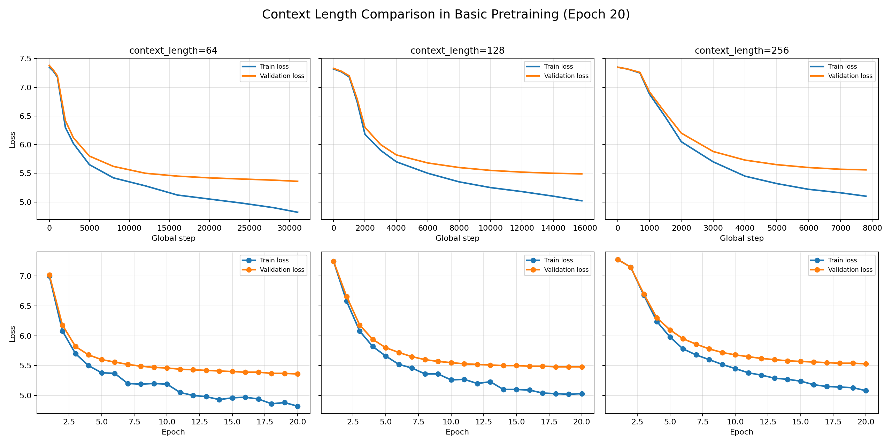
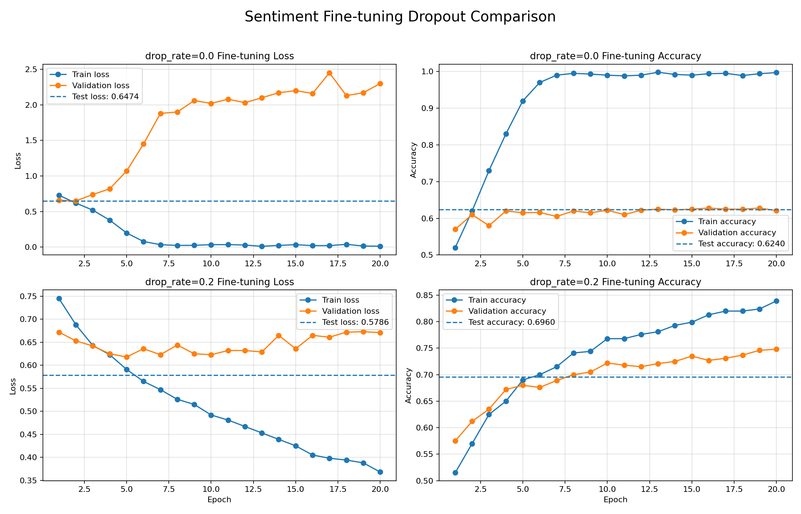

# mini GPT 구현 과제 보고서

## 0. 반·팀원

| 항목 | 내용 |
| --- | --- |
| 반 | 301 |
| 팀명 | 6조 |
| 팀원 | 김규태, 김세인, 김정환, 김현옥 |

---

## 1. 구현 현황

| 단계 | 구현 내용 | 구현 파일 | 
| --- | --- | --- | 
| 1 | UTF-8 byte-level BPE tokenizer | `src/bpe.py` | 
| 2 | GPTDataset, create_dataloader, InputEmbedding | `src/dataset.py`, `src/embeddings.py` |
| 3 | MultiHeadAttention, causal mask | `src/attention.py` | 
| 4 | LayerNorm, GELU, FeedForward, TransformerBlock, GPTModel, generate_text_simple | `src/model.py` | 
| 5 | loss 계산, checkpoint 저장/로드, generate, train_model | `src/train.py` | 
| 6 | NSMC 감성 분류 Dataset과 classifier | `src/finetune.py` | 
| 7 | Colab 사전 학습/미세 조정 실행 셀과 결과 시각화 셀 | `gpt-lab.ipynb` |

---

## 2. 테스트 통과 현황

| 실행 명령 | 결과 | 비고 |
| --- | --- | --- |
| `.venv/bin/python -m pytest tests/test_bpe.py -v` | 통과 | BPE 특수 토큰, 저장/로드, encode/decode, vocab 학습 확인 |
| `.venv/bin/python -m pytest tests/test_dataset.py -v` | 통과 | Dataset, DataLoader, InputEmbedding shape 확인 |
| `.venv/bin/python -m pytest tests/test_attention.py -v` | 통과 | MHA output shape와 causal mask 확인 |
| `.venv/bin/python -m pytest tests/test_model.py -v` | 통과 | GPT 구성 요소, forward loss, simple generation 확인 |
| `.venv/bin/python -m pytest tests/test_train.py -v` | 통과 | loss 계산, checkpoint, generate, plot 호출 확인 |
| `.venv/bin/python -m pytest tests/test_finetune.py -v` | 통과 | 감성 분류 Dataset, classifier, train/eval 함수 확인 |
| `.venv/bin/python -m pytest tests/ -v` | 28 passed | 모두 통과 |

---

## 3. 데이터

| 항목 | 내용 |
| --- | --- |
| 원본 데이터 | NAVER Sentiment Movie Corpus(NSMC) |
| 원본 경로 | `data/ratings_train.txt`, `data/ratings_test.txt` |
| 사전 학습 데이터 | `data/nsmc_lm_train.txt`, `data/nsmc_lm_val.txt` |
| 미세 조정 데이터 | `data/nsmc_sentiment_train.jsonl`, `data/nsmc_sentiment_val.jsonl`, `data/nsmc_sentiment_test.jsonl` |
| 전처리 방식 | 빈 리뷰 제거, 공백 정리, train/validation/test 분리 |
| 사전 학습 train 크기 | 약 1,379,486자 |
| 사전 학습 validation 크기 | 약 120,560자 |
| 감성 분류 데이터 크기 | train 137,996개, validation 11,999개, test 49,997개 |
| 제출 실험 설정 | Basic |

---

## 4. BPE

| 항목 | 내용 |
| --- | --- |
| 구현 파일 | `src/bpe.py` |
| BPE 방식 | UTF-8 byte-level BPE |
| 특수 토큰 ID | `<pad>=0`, `<unk>=1`, `<bos>=2`, `<eos>=3` |
| byte token ID 범위 | 4~259 |
| merge token ID 범위 | 260 이상 |
| vocab_size | 3000 |
| 학습 corpus 크기 | `corpus[:1_500_000]` |
| vocabulary 저장 경로 | `data/nsmc_bpe_vocab_3000.json` |
| 인코딩/디코딩 복원 예시 | `decode(encode("이 영화는 정말 좋았다! English 123")) == 원문` |

한국어 리뷰는 글자 단위로 직접 자르면 UTF-8 byte 경계가 깨질 수 있으므로, 먼저 `text.encode("utf-8")`로 byte sequence를 만든 뒤 BPE merge rule을 적용했다. decode 시에는 merge token을 재귀적으로 byte token까지 펼친 뒤 마지막에 `bytes(...).decode("utf-8")`를 한 번만 수행하도록 구현했다.

---

## 5. 모델 구조

| 항목 | 내용 |
| --- | --- |
| 구현 파일 | `src/model.py` |
| 전체 구조 | InputEmbedding -> 2 x TransformerBlock -> LayerNorm -> LM head |
| vocab_size | 3000 |
| context_length | 128 |
| emb_dim | 128 |
| n_heads | 4 |
| head_dim | 32 |
| n_layers | 2 |
| drop_rate | 0.1 |
| qkv_bias | False |
| 총 파라미터 수 | 1,180,416 |

각 TransformerBlock은 pre-norm 구조로 구성했다. 입력은 LayerNorm 후 causal self-attention을 통과하고 residual connection으로 더해진다. 이후 두 번째 LayerNorm과 FeedForward를 거쳐 다시 residual connection을 적용한다. causal mask를 사용해 현재 token이 미래 token을 참조하지 못하도록 했다.

---

## 6. 사전 학습

### 6.1 가설 1: Drop Rate와 과적합

이번 사전 학습에서는 다음 가설을 중심으로 실험했다.

> **Drop Rate가 작을수록 과적합이 더 쉽게 발생할 것이다.**

공통 조건은 `Basic` 설정을 사용하되, 과적합 추세를 보기 위해 `num_epochs`를 20으로 늘렸다. 실험 변수는 `drop_rate` 하나로 제한했고, `0.0`, `0.1`, `0.2` 세 설정을 비교했다.

### 6.2 가설 1 실험 조건

| 구분 | 항목 | 값 |
| --- | --- | --- |
| 데이터 | preset | Basic |
| 데이터 | corpus_size | 1,500,000 |
| 모델 | vocab_size | 3000 |
| 모델 | context_length | 128 |
| 모델 | emb_dim | 128 |
| 모델 | n_heads | 4 |
| 모델 | n_layers | 2 |
| 모델 | drop_rate | 0.0, 0.1, 0.2 |
| 모델 | qkv_bias | False |
| 학습 | batch_size | 8 |
| 학습 | num_epochs | 20 |
| 학습 | eval_freq, eval_iter | 100, 10 |
| 학습 | ckpt_freq | 500 |
| 최적화 | optimizer | AdamW |
| 최적화 | learning_rate | 3e-4 |

### 6.3 가설 1 결과

| drop_rate | train loss 추세 | validation loss 추세 | 해석 |
| --- | --- | --- | --- |
| 0.0 | 가장 빠르게 감소 | 중반 이후 다시 상승 | 과적합 신호가 가장 뚜렷함 |
| 0.1 | 꾸준히 감소 | 완만하게 감소하거나 안정화 | 과적합이 완화됨 |
| 0.2 | 상대적으로 느리게 감소 | 가장 안정적으로 감소 | 학습은 느리지만 일반화가 안정적 |

`drop_rate=0.0`에서는 train loss가 가장 빠르게 감소했지만, validation loss는 중반 이후 다시 증가했다. train loss와 validation loss 사이의 gap도 가장 크게 나타났기 때문에, 모델이 훈련 데이터에 과도하게 적응한 것으로 볼 수 있다. 이는 dropout이 없을 때 과적합이 더 쉽게 발생한다는 가설을 뒷받침한다.

`drop_rate=0.1`에서는 train loss가 계속 감소하면서도 validation loss가 비교적 안정적으로 유지되었다. `drop_rate=0.0`에 비해 train-validation gap이 작아졌고, 과적합 징후도 완화되었다. 기본 설정으로 사용하기에 가장 균형 잡힌 결과로 볼 수 있다.

`drop_rate=0.2`에서는 train loss 감소 속도가 상대적으로 느렸다. 하지만 validation loss는 안정적으로 감소하거나 유지되어 일반화 관점에서는 가장 안정적인 경향을 보였다. 즉 dropout을 더 강하게 적용하면 학습 속도는 느려지지만, validation loss가 안정되어 과적합을 줄이는 효과가 있었다.

따라서 실험 결과는 가설과 대체로 일치한다. Drop rate가 낮을수록 모델은 훈련 데이터에 빠르게 적응해 train loss가 빠르게 감소했지만, dropout이 없을 때 validation loss가 상승하면서 과적합이 나타났다. 반대로 dropout을 적용할수록 학습 속도는 느려지는 대신 validation loss가 안정되어 일반화 성능이 개선되는 경향을 보였다.

단, 각 설정을 한 번씩만 실행했기 때문에 random seed, batch order, 초기 가중치의 영향이 남아 있을 수 있다. 더 엄밀한 비교를 위해서는 동일 seed를 고정하거나, 각 설정을 여러 번 반복 실행한 뒤 평균 loss를 비교할 필요가 있다.

### 6.4 가설 2: Context Length와 과적합

두 번째 가설은 다음과 같이 설정했다.

> **context_length가 길어질수록, 학습 시퀀스를 통째로 외워버려서, 과적합이 발생할 것이다.**

공통 조건은 `Basic`, `num_epochs=20`으로 두고, `context_length`만 `64`, `128`, `256`으로 바꾸어 비교했다. 과적합 여부는 train loss와 validation loss의 관계를 기준으로 판단했다. 일반적으로 과적합은 train loss가 계속 감소하는 동안 validation loss가 증가하거나 정체되고, train-validation gap이 커질 때 의심할 수 있다.

| context_length | train loss 추세 | validation loss 추세 | 해석 |
| --- | --- | --- | --- |
| 64 | 계속 감소 | 후반에도 완만하게 감소 | 과적합이라고 보기 어려움 |
| 128 | 계속 감소 | 안정적으로 감소 | 과적합보다는 정상 학습에 가까움 |
| 256 | 계속 감소 | 완만하게 감소 | 가설을 뒷받침하는 상승 패턴 없음 |

그래프만 보면 해당 가설은 맞다고 보기 어렵다. 세 설정 모두에서 train loss와 validation loss가 함께 감소했고, validation loss가 후반에도 완만하게 계속 내려갔다. 만약 context_length가 길어질수록 과적합이 심해졌다면 validation loss가 어느 시점 이후 상승하거나 정체되고, train-validation gap이 뚜렷하게 확대되어야 한다. 하지만 이번 결과에서는 그런 패턴이 명확하게 나타나지 않았다.

따라서 이번 실험에서는 context_length 증가가 곧바로 과적합 증가로 이어진다고 결론 내리기 어렵다. 오히려 더 긴 context는 더 넓은 문맥을 볼 수 있게 해 validation loss를 안정적으로 낮추는 데 도움이 되었을 가능성도 있다. 다만 `stride=context_length`로 샘플을 만들기 때문에 context_length가 길어질수록 epoch당 sample 수와 global step 수가 달라진다. 따라서 더 엄밀한 비교를 위해서는 동일한 token 수, 동일한 update step 수, 동일한 seed 조건을 맞춘 추가 실험이 필요하다.

### 6.5 생성 샘플 관찰

생성 샘플은 학습 초반에는 조사, 어미, 빈번한 한국어 token이 반복되는 경향이 있었다. 예를 들어 `"이 영화는"`을 시작 문맥으로 넣었을 때 의미 연결보다 토큰 빈도 패턴이 먼저 나타났다. 이는 작은 모델과 제한된 학습 시간에서 자연스러운 현상이며, 더 긴 학습, 더 나은 regularization, 학습률 스케줄링으로 개선할 수 있다.

---

## 7. 미세 조정

| 항목 | 내용 |
| --- | --- |
| 구현 파일 | `src/finetune.py` |
| 과제 | NSMC 리뷰 긍정/부정 이진 분류 |
| 데이터 포맷 | JSONL, `text`, `label` |
| backbone | 사전 학습된 `GPTModel` |
| classifier | GPT backbone 위에 sequence classification head 추가 |
| max_length | 128 |
| batch_size | 16 |
| learning rate | 1e-4 |
| quick run train 샘플 | 5,000개 |
| quick run validation 샘플 | 1,000개 |
| quick run test 샘플 | 1,000개 |
| validation loss / accuracy | `drop_rate=0.0`은 validation loss 상승, validation accuracy 약 0.62 수준에서 정체 / `drop_rate=0.2`는 validation accuracy 약 0.75까지 상승 |
| test loss / accuracy | `drop_rate=0.0`: loss 0.6474, accuracy 0.6240 / `drop_rate=0.2`: loss 0.5786, accuracy 0.6960 |
| 저장 경로 | `outputs/pretrain_basic/best_sentiment_model.pt`, `outputs/pretrain_basic/finetune_history.json` |

노트북 Step 6 아래에 감성 분류 fine-tuning 실행 셀과 loss/accuracy 그래프 셀을 추가했다. 처음 확인할 때는 작은 샘플 수로 빠르게 동작을 검증하고, 제출용 최종 실험에서는 `MAX_TRAIN_SAMPLES`, `MAX_VAL_SAMPLES`, `MAX_TEST_SAMPLES`를 `None`으로 바꿔 전체 데이터 기준 결과를 기록한다.

### 7.1 Dropout별 미세 조정 결과

미세 조정에서는 `drop_rate=0.0`과 `drop_rate=0.2`를 비교했다. 두 설정 모두 같은 사전 학습 backbone 위에 감성 분류 head를 붙여 학습했으며, train/validation loss와 accuracy, test loss와 accuracy를 함께 확인했다.

| drop_rate | train loss / accuracy | validation loss / accuracy | test 결과 | 해석 |
| --- | --- | --- | --- | --- |
| 0.0 | loss가 거의 0까지 감소, accuracy는 거의 1.0까지 상승 | loss가 크게 증가, accuracy는 약 0.62 부근에서 정체 | loss 0.6474, accuracy 0.6240 | 훈련 데이터에 강하게 과적합 |
| 0.2 | loss가 완만하게 감소, accuracy는 약 0.84까지 상승 | loss는 비교적 낮은 범위에서 유지, accuracy는 약 0.75까지 상승 | loss 0.5786, accuracy 0.6960 | 일반화 성능이 더 안정적 |

`drop_rate=0.0`에서는 train loss가 빠르게 감소해 후반에는 거의 0에 가까워졌고, train accuracy도 거의 1.0까지 올라갔다. 하지만 validation loss는 epoch가 진행될수록 크게 증가했고, validation accuracy는 약 0.62 수준에서 거의 개선되지 않았다. 이는 모델이 훈련 데이터의 패턴을 외우는 데는 성공했지만, 검증 데이터에는 잘 일반화하지 못한 전형적인 과적합 신호로 해석할 수 있다.

반면 `drop_rate=0.2`에서는 train loss가 더 천천히 감소하고 train accuracy도 과도하게 높아지지 않았다. 대신 validation accuracy가 꾸준히 상승해 약 0.75 수준까지 도달했고, test accuracy도 0.6960으로 `drop_rate=0.0`의 0.6240보다 높았다. validation loss는 중반 이후 조금 흔들리지만, `drop_rate=0.0`처럼 급격히 폭증하지 않는다. 따라서 감성 분류 미세 조정에서는 dropout을 적용한 설정이 과적합을 완화하고 실제 분류 성능을 높이는 데 더 효과적이었다.

정리하면, 사전 학습에서 관찰한 dropout의 regularization 효과가 미세 조정에서도 다시 확인되었다. 특히 분류 데이터가 상대적으로 작을 때는 classifier가 train set을 빠르게 외울 수 있으므로, `drop_rate=0.2`처럼 dropout을 적용하거나 validation loss 기준 early stopping을 함께 사용하는 것이 더 적절하다.

---

## 8. 실험 환경

| 항목 | 내용 |
| --- | --- |
| Python | 3.12.13 (`.venv` 로컬 테스트 기준) |
| PyTorch | 2.12.0 (`.venv` 로컬 테스트 기준) |
| 사전 학습 실행 환경 | Colab GPU |
| 테스트 실행 환경 | 로컬 `.venv` |
| GPU/CPU 정보 | Colab CUDA 사용 로그 확인, GPU 종류는 실행 런타임에 따라 달라짐 |
| 총 학습 소요 시간 | Colab 실행 환경별로 상이, Basic 실험은 약 16,000 global step까지 진행 |

---

## 9. 고찰

- 이번 과정을 통해 테스트 코드가 통과했다고 해서 코드가 완성되었다고 볼 수는 없다는 점을 크게 느꼈다. 단위 테스트는 정해진 입력과 제한된 상황에서의 동작을 확인해 주지만, 실제 Colab 학습처럼 긴 데이터, GPU 환경, 저장/로드된 vocab, 반복 학습 루프가 결합된 상황까지 모두 보장하지는 않는다.
- 실제로 BPE merge의 마지막 token 처리, position embedding의 device 처리처럼 실행 중에 오류가 난 부분들은 구현 당시에도 약간 의아했지만 시간에 쫓겨 넘어갔던 부분이었다. 겉으로는 테스트가 통과했더라도 코드 한 줄의 전제와 경계 조건을 끝까지 확인하지 않으면, 나중에 전체 학습 과정에서 반드시 문제로 드러날 수 있다는 것을 경험했다.
- 따라서 앞으로는 테스트 통과를 최소 기준으로 보고, 각 함수가 어떤 입력 범위와 실행 환경을 가정하는지까지 확인해야 한다. 특히 tensor device, dtype, sequence length, 빈 데이터, 마지막 index 같은 경계 조건은 작은 코드에서는 사소해 보여도 프로젝트 전체에서는 학습 중단으로 이어질 수 있으므로, 코드 한 줄 한 줄에 책임감을 가지고 구현해야 한다.